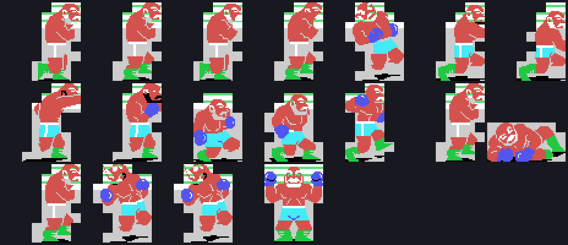

# Findings

What turned up when we took it apart. Each one with its measurement.

## Six opponents and only THREE sets of figures

There are six names, in a table of six pointers (0x5661). The **drawings** come
from another table, the one at 0x52C9, and that one has **three** words:
0x825C, 0x9670 and 0xABB4, the tables of figure archives 2, 3 and 4. 0x4F8D
indexes it with `(0xE207) & 3`.

A fourth word would fall at 0x52CF, which is already code. But it is never
read: 0x423B forces the jump to the next group of sixteen as soon as
`(0xE207) & 3` reaches 2, so the index is only ever 0, 1 or 2.

The three opponents of the second round are the first three **with the colour
swapped**: 0x526F and 0x51BE turn colour 4 into 0x0C when (0xE207) has bit 4
set.

## Throwing a punch tires you

When a punch ends, `acaba_el_golpe` (0x49BC) adds to **whoever threw it** what
the table at 0x6854 says, and the result goes onto his own damage:

| punch | hurts the other (0x6850) | tires the thrower (0x6854) |
|---|---|---|
| 5 | 12 | 3 |
| 6 | 10 | 2 |
| 7 | 9 | 1 |
| 8 | 2 | 1 |

Both tables run in the **same order**: the punch that hurts most is also the
one that tires most. And above level 7 it stops rising: `cp 007h` at 0x49E4.

## The punch only lands on the seventh and eighth frame

0x49FB loads **0xC0** into (0xE24C) or (0xE24D), and `pega_el_de_la_derecha`
(0x4CCF) spends it with one `srl` per frame, bailing out with `ret nc` while
there is no carry. Out of 0xC0, carry only comes on the seventh and eighth
turn. Outside that window the punch cannot land.

## The scorecard is kept upside down

(0xE21E) and (0xE21F) are the judges' cards, and they do not add up points:
they add up **faults**.

- one if a boxer carries **three levels or more** of damage than the other;
- one to whoever landed fewer punches;
- and twice whatever (0xE23E) or (0xE261) says.

At the end, 0x4ECD does `10 - faults` on both and then **raises them together**
until one reaches ten. It is the ten-point must system of real boxing.

## The machine plays the left-hand boxer

With a single player, the left-hand boxer is driven by `decide_la_maquina`
(0x4A6B) and the human is the one on the right, the one wired to port 1 and the
cursor keys. Three independent things say so:

1. when they are placed (0x49FE), the one at 0xE232 gets column 22 and the one
   at 0xE255 column 2;
2. when walking, the one at 0xE255 closes in by **adding** and the one at
   0xE232 by **subtracting**, and the column limits are 22 above for one and 2
   below for the other;
3. the machine closes in **walking right** (0x4A83) and backs off to the left
   (0x4B39), which is what the left-hand corner calls for.

In scene 2 &mdash;the attract match&mdash; the right-hand boxer is driven by
the Z80's **R** register (0x4836): both of them play on their own.

The machine returns the action in B with a bonus number in the high nibble, and
that number is added to (0xE254) **while it walks**. (0xE254) is what later
picks the punch script at 0x4C1C: the more it walks, the more what it is about
to do changes.

## The eight bytes nobody was reading

A figure's header is `17 + 5N` long. Of that, the **eight bytes** 0x500C skips
with a `ld a,008h` &mdash;the ones at `figure + 9 + 3N`&mdash; are the
**layout**: one per row, the high nibble saying how far right to shift and the
low one how many tiles run together. From 8 upwards, that row is not drawn.

With them the figure places itself, and the proof is not that it looks right:
the name table that comes out matches the emulator's **byte for byte**.

## The sixth opponent is called MOAI Jr.

Tile 0x58 is not the ASCII X. Drawing the font shows it is a glyph with the
**"r" and the full stop joined**, so the name `04 4D 4F 41 49 51 4A 58` reads
**MOAI&middot;Jr.** &mdash;MOAI&middot;KING's son, with whom he shares figure
archive 4, which is a moai.

## The backdrop is not the one in the boot table

R7 = 0xE4 comes from the eight registers at 0x4429, and it says the border is
blue. But `monta_una_columna_del_fondo` (0x439E) writes **0xE1** into R7 on
every call, and from the intro onwards the backdrop is **black**. It showed up
against the emulator: building the screen with the blue from the table leaves
it a different colour.

## Code nobody calls

Three stretches that are valid instructions, fit between the routines either
side of them, and that **no `call`, no `jp` and no word of any table** reaches
&mdash;checked by searching for the two bytes across the whole ROM:

- **0x4038**, which leaves the VDP data port in C, the same as the tail of
  `prepara_la_escritura`;
- **0x45CA**, a sibling of `descomprime_en_tres_bancos` that uses
  `vuelca_en_la_vram` instead of the decompressor;
- **0x54EC**, an alternative entry to the piece painter.

And one more that does run and does nothing: 0x470D writes to 0x4F84, which is
**ROM**.
