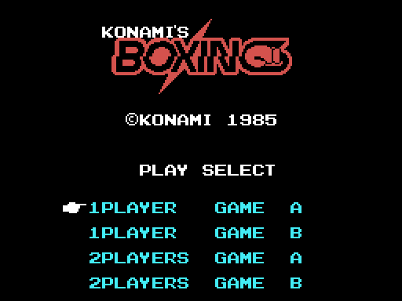
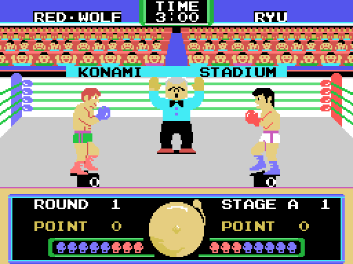
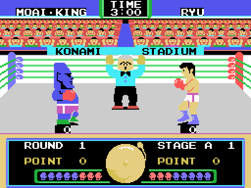
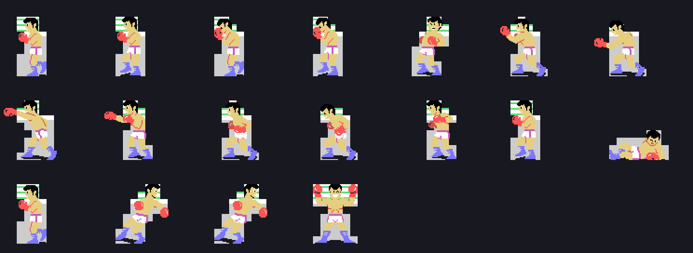
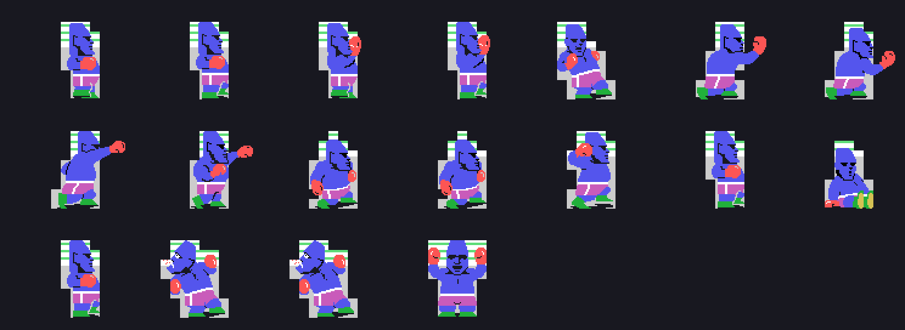
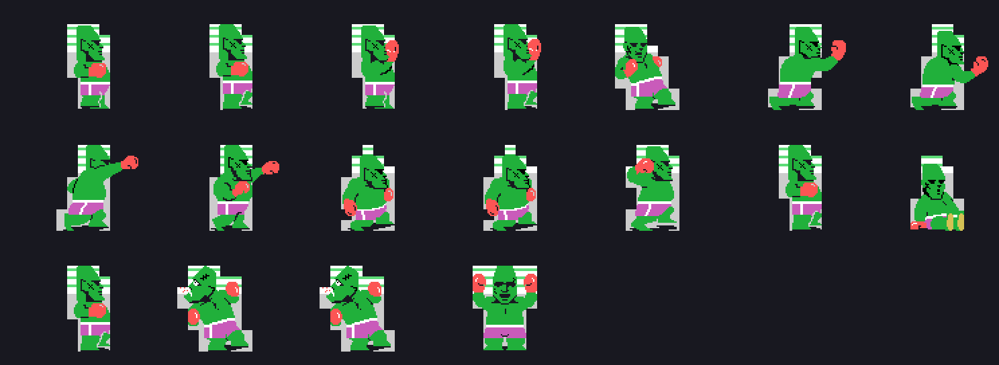

# The game

*Konami's Boxing* is a side-on boxing match for one or two players. Konami
published it for the MSX in 1985 with catalogue number **RC-736**.

## The four options

The title screen offers four, and all four come down to **a single flag byte**
that `lee_el_menu` (0x4502) copies into (0xE002) from the table at 0x4563:

| option | byte | bit 0 | bit 4 |
|---|---|---|---|
| 1PLAYER GAME A | 0x40 | | |
| 1PLAYER GAME B | 0x50 | | hard |
| 2PLAYERS GAME A | 0x61 | two play | |
| 2PLAYERS GAME B | 0x71 | two play | hard |

**Bit 0** is what decides whether the machine plays: with it set, 0x47C0 skips
`decide_la_maquina` and both boxers read their own controls. **Bit 4** picks
the hard variant, which 0x42F5 turns into (0xE206) = 3 and (0xE207) = 0x10.

## The six opponents

The names come from a table of six pointers at 0x5661, and they read out with
the cartridge's own font: **RED&middot;WOLF**, **M.B.ALLI**,
**MOAI&middot;KING**, **SANCHESS**, **CHINA&middot;KHAN** and
**MOAI&middot;Jr.** The player is always **RYU** (0x56AF), and his name does
not come from the table: 0x55A0 puts it up separately.

The **figures** come from three archives, and the six still look different:
each archive hides a piece that only the second round paints. See
[Findings](FINDINGS.html).

## The round

Three minutes, counted in four ASCII tiles from (0xE212) to (0xE215) that
start at 3:01 and after the first tick read **3:00**. Three rounds to a bout:
(0xE210) counts them and 0x57C7 bumps it.

Below, the strip of **twenty-two tiles** on row 22 is a single bar that the two
boxers eat into from the ends: the left-hand one from the start and the
right-hand one from the finish (0x5448). Once the damage passes level 6, the
two tiles at the edge **blink** with bit 4 of the frame counter.

## The boxers

Each boxer has **nineteen** poses. The body is made of **tiles** redefined
every frame; the head, the hair and the gloves are 16x16 **sprites**. The
sheets are built the way the ring is: the tiles placed with the eight layout
bytes of each figure and the sprites on top, with the pieces (0xE207) says.
The poses run from the guard to the knockdown, and the last one is the victory
pose, both gloves in the air.

